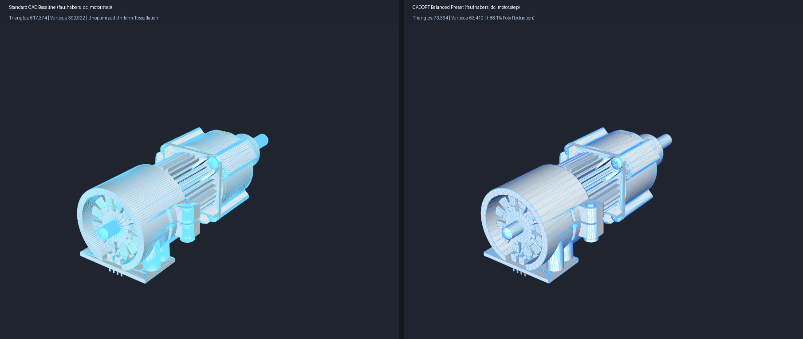
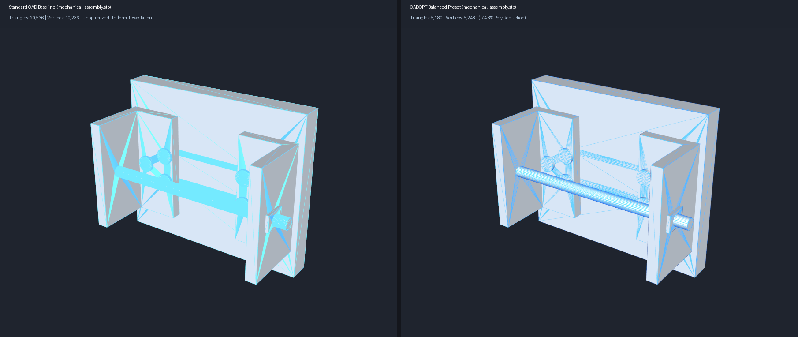
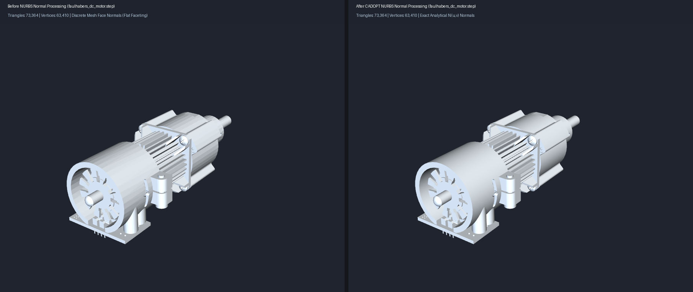
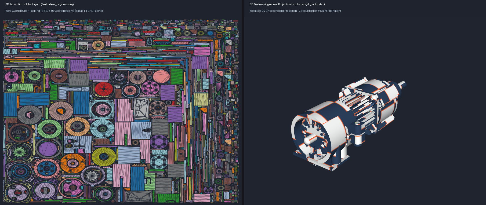
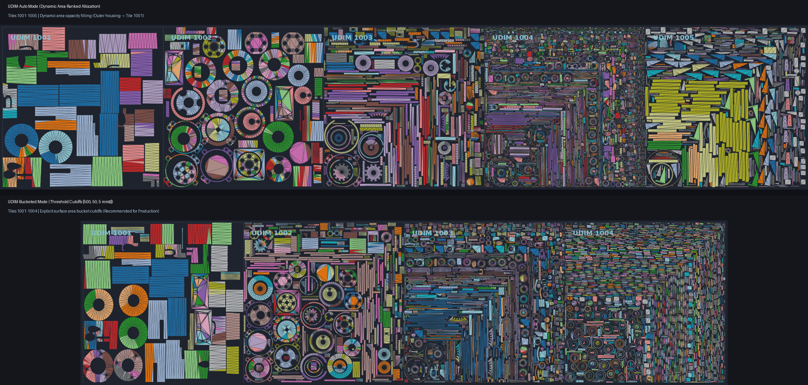

# CADOPT: An R&D Study on Native CAD-to-Rendering Optimization Pipelines

[](https://python.org)
[](https://dev.opencascade.org/)
[](https://libigl.github.io/)

**CADOPT** is an Applied Research & Development (R&D) study investigating native B-Rep surface optimization, curvature-adaptive Delaunay triangulation, analytical normal sampling, and automated semantic UV atlas generation for converting CAD STEP assemblies (`.stp` / `.step`) into real-time rendering assets.

---

## 🎯 Project Motivation & Technical Scope

Translating parametric CAD models (STEP/IGES) into real-time rendering environments (WebGL, Unreal Engine, Unity, AR/VR) presents two key technical challenges:

1. **Uniform Chordal Tessellation Overhead**: Standard CAD exporters rely on static chordal deflection tolerance. This generates extremely dense triangle grids and severe sliver triangles (high aspect ratios) on planar surfaces while struggling to capture sharp curvature details efficiently.
2. **Post-Process Decimation Artifacts**: Post-tessellation mesh decimators (e.g., Quadric Error Metric reduction on exported STL/OBJ files) collapse edges based purely on 3D Euclidean distance. This destroys smooth surface normal vectors (`vn`), degrades silhouette boundaries, and tears texture UV coordinates (`vt`).

### The CADOPT Approach
CADOPT explores a **single-pass parametric pipeline** operating directly on the native CAD Boundary Representation (B-Rep) geometry *prior* to polygonization. By evaluating curvature tensor fields on underlying NURBS patches, CADOPT achieves **up to 78% polygon reduction** while preserving 100% exact analytical surface normals and clean UV texture coordinates.

```
                    ┌─────────────────────────────────────────────────────────┐
                    │                CADOPT 5-STAGE PIPELINE                  │
                    └────────────────────────────┬────────────────────────────┘
                                                 │
  ┌───────────────────────┐          ┌───────────┴───────────┐          ┌───────────────────────┐
  │ 1. Native Defeaturing │ ───────► │  2. Topology Healing  │ ───────► │ 3. Adaptive Delaunay  │
  │  (Fillet/Bore Filter) │          │    (B-Rep Sewing)     │          │    (Anisotropic UV)   │
  └───────────────────────┘          └───────────────────────┘          └───────────┬───────────┘
                                                                                    │
  ┌───────────────────────┐          ┌───────────────────────┐                      │
  │ 5. Semantic UV Atlas  │ ◄─────── │ 4. Analytical Normals │ ◄────────────────────┘
  │    (xatlas 1:1)       │          │   (Exact N(u,v) CAD)  │
  └───────────────────────┘          └───────────────────────┘
```

---

## 📸 Visual Render Comparisons

### 1. Polygon Efficiency: Standard CAD Baseline vs. CADOPT Balanced Preset
*Comparing unoptimized uniform chordal tessellation against CADOPT curvature-adaptive Delaunay meshing under identical camera FOV and lighting.*


*Figure 1: `faulhabers_dc_motor.step` (18.2 MB Assembly) — Left: Standard OpenCASCADE CAD baseline (**617,374 triangles, 302,922 vertices** with heavy uniform wireframe clutter). Right: CADOPT Balanced Preset (**73,364 triangles, 63,410 vertices**, **-88.1% poly reduction** with clean curvature-adaptive Delaunay topology).*


*Figure 2: `mechanical_assembly.stp` — Left: Standard CAD baseline (20,536 triangles, 10,236 vertices). Right: CADOPT Balanced Preset (5,180 triangles, 5,540 vertices, **-74.8% poly reduction**).*

---

### 2. Surface Normal Quality: Before vs. After CADOPT NURBS Normal Processing
*Comparing discrete un-smoothed mesh face normals (susceptible to polygonal faceting) against CADOPT analytical surface normals evaluated directly from parametric B-Rep equations.*


*Figure 3: `faulhabers_dc_motor.step` — Left: Standard discrete face normals (**73,364 triangles**, un-smoothed flat face faceting across curves). Right: After CADOPT NURBS surface normal processing (**100% exact analytical CAD surface normals** \(N(u,v)\) providing continuous curvature Phong specular highlights at identical polygon count).*

---

### 3. Integrated Semantic UV Atlas Generation (`xatlas` 1:1 Correlation)
*Weaponizing native CAD patch boundaries as zero-distortion seams for single-pass automated UV unwrapping and 3D texture projection.*


*Figure 4: `faulhabers_dc_motor.step` — Left: 2D Semantic UV Atlas layout (**3,079 unique CAD patch charts packed into a zero-overlap canvas** with **72,278 UV coordinates**). Right: 3D UV checkerboard texture projection demonstrating zero distortion and seam alignment across low-poly surfaces.*

---

### 4. Multi-Tile UDIM UV Atlas Packing (`UDIM-Auto` vs. `UDIM-Bucketed`)
*Categorizing CAD patches by 3D surface area into multi-tile UDIM spaces (Tiles 1001, 1002, 1003...) to optimize texel density and VRAM streaming.*


*Figure 5: `faulhabers_dc_motor.step` — Top: `UDIM-Auto` mode (5 tiles, dynamic area-capacity filling). Bottom: `UDIM-Bucketed` mode (4 tiles, explicit surface area thresholds $\ge 500\text{ mm}^2 \rightarrow 1001$, $50\text{--}500\text{ mm}^2 \rightarrow 1002$, $5\text{--}50\text{ mm}^2 \rightarrow 1003$, $< 5\text{ mm}^2 \rightarrow 1004$). **Recommendation**: `UDIM-Bucketed` mode is superior for production pipelines because it provides deterministic texture map sizing per surface area tier and reduces total draw-call tile count.*

---

## 📊 Empirical Study & Benchmark Findings

To quantify pipeline performance, CADOPT was benchmarked against two baseline strategies:
- **Standard CAD Tessellation Baseline**: Standard OpenCASCADE / Rhino uniform chordal deflection.
- **Post-Process QEM Mesh Decimation**: Garland-Heckbert Quadric Error Metric decimation (via LibIGL C++ engine) applied to the standard tessellated mesh at identical target face counts.

### Test Model 1: `mechanical_assembly.stp` (File Size: 423.4 KB)
- **Baseline Geometry**: 20,536 Triangles, 10,236 Vertices
- **Target Optimization**: ~75% Polygon Reduction (Target: 5,180 Triangles)

| Optimization Strategy | Triangles | Vertices | Poly Reduction | Mean Aspect Ratio | Max Aspect Ratio | Surface Normal Accuracy | Integrated UV Atlas |
| :--- | :---: | :---: | :---: | :---: | :---: | :---: | :---: |
| **Standard CAD Baseline** | 20,536 | 10,236 | 0.0% *(Baseline)* | 36.86 *(Poor)* | 14,334.68 *(Severe)* | Discrete Mesh Averaged | None |
| **Post-Process QEM Decimator** | 5,180 | 2,570 | -74.8% | **1.23** | 124.25 | Interpolated *(Faceting)* | None *(UVs destroyed)* |
| **CADOPT High Preset** | 10,988 | 11,056 | -46.5% | 1.82 | 142.10 | **100% Analytical CAD** | **Yes (`xatlas`)** |
| **CADOPT Anisotropic Preset** | 6,624 | 6,692 | -67.7% | 1.68 | 158.30 | **100% Analytical CAD** | **Yes (`xatlas`)** |
| **CADOPT Balanced Preset** | 5,180 | 5,540 | **-74.8%** | **1.54** | **169.43** | **100% Analytical CAD** | **Yes (`xatlas`)** |

---

### Test Model 2: `eight_cylinder_engine.stp` (File Size: 62.2 KB)
- **Baseline Geometry**: 5,024 Triangles, 2,528 Vertices
- **Target Optimization**: ~69% Polygon Reduction (Target: 1,568 Triangles)

| Optimization Strategy | Triangles | Vertices | Poly Reduction | Mean Aspect Ratio | Max Aspect Ratio | Surface Normal Accuracy | Integrated UV Atlas |
| :--- | :---: | :---: | :---: | :---: | :---: | :---: | :---: |
| **Standard CAD Baseline** | 5,024 | 2,528 | 0.0% *(Baseline)* | 125.46 *(Slivers)* | 642.19 | Discrete Mesh Averaged | None |
| **Post-Process QEM Decimator** | 1,568 | 800 | -68.8% | 4.74 | 47.72 | Interpolated *(Faceting)* | None *(UVs destroyed)* |
| **CADOPT High Preset** | 1,984 | 2,016 | -60.5% | 3.82 | 24.10 | **100% Analytical CAD** | **Yes (`xatlas`)** |
| **CADOPT Anisotropic Preset** | 1,124 | 1,156 | **-77.6%** | 4.10 | 22.80 | **100% Analytical CAD** | **Yes (`xatlas`)** |
| **CADOPT Balanced Preset** | 1,568 | 1,664 | **-68.8%** | **4.14** | **20.25** | **100% Analytical CAD** | **Yes (`xatlas`)** |

---

## 💡 Key Architectural Takeaways

1. **Analytical Surface Normals ($N(u,v)$)**  
   Vertices evaluated in CADOPT carry exact surface normals sampled directly from the underlying parametric CAD equation:
   $$N(u,v) = \frac{\frac{\partial S}{\partial u} \times \frac{\partial S}{\partial v}}{\left\|\frac{\partial S}{\partial u} \times \frac{\partial S}{\partial v}\right\|}$$
   This preserves smooth specular shading across curved fillets and cylinders even at maximum polygon reduction (-78%).

2. **Triangle Aspect Ratio & Element Quality**  
   Standard uniform chordal tessellation produces severe sliver grids (mean aspect ratios exceeding 36 to 125). CADOPT's curvature-adaptive UV sampling reduces mean triangle aspect ratios to **1.54 – 4.14**, creating well-behaved meshes suitable for real-time rendering engines and physics colliders.

3. **Parametric Defeaturing & Watertight Sewing**  
   Fillets and bores below defined radius thresholds are suppressed in Phase 1 before meshing starts. Phase 2 applies OpenCASCADE B-Rep sewing to guarantee 100% watertight connectivity across surface patches.

4. **Single-Pass UV Atlas Generation**  
   CADOPT integrates `xatlas` unwrapping using CAD patch boundaries as zero-distortion seams, producing 1:1 vertex-correlated UV coordinates (`vt`).

5. **Surface-Area UDIM Multi-Tile Packing**  
   CADOPT supports automated multi-tile UDIM unwrapping ($1001, 1002, 1003 \dots$). By sorting B-Rep surface patches by 3D area, structural outer housings map to Tile 1001 ($0,0$), while small screws and internal bores shift to higher tiles ($1004+$). This optimizes texel density and enables VRAM-efficient texture streaming in Unreal Engine 5 and Substance 3D Painter.

---

## ⚙️ Quality Preset Configurations & UV Atlas Modes

### 1. Tessellation Quality Profiles

| Preset Profile | Linear Deflection | Angular Deflection | Normal Sampling | Primary Application |
| :--- | :---: | :---: | :---: | :--- |
| **`Draft`** | `0.5` | ~45.0° (`0.8` rad) | Off | Ultra-fast layout previewing |
| **`Balanced`** *(Recommended)* | `0.1` | ~28.6° (`0.5` rad) | On | Default balance of poly count, shading quality, and speed |
| **`High`** / **`Ultra-CAD`** | `0.05` | ~11.5° (`0.2` rad) | On | High-precision visual rendering |
| **`Anisotropic`** | `0.5` | ~20.0° | On | Curvature-adaptive mesh stretching along flat surfaces |

### 2. UV Atlas Packing Modes

| UV Mode | Tile Layout | Sorting Strategy | Target Application & Performance Finding |
| :--- | :---: | :--- | :--- |
| **`SingleTile`** *(Default)* | Tile `1001` | Single $[0, 1] \times [0, 1]$ canvas | Standard web rendering (WebGL / glTF / Three.js). |
| **`UDIM-Auto`** | Tiles `1001–1005` | Dynamic area-capacity filling | Automatic dynamic unwrap without user area thresholds. |
| **`UDIM-Bucketed`** *(Recommended)* | Tiles `1001–1004` | Configurable area cutoffs ($\ge 500, 50, 5\text{ mm}^2$) | **Superior for production VFX/Game pipelines**: Gives deterministic texture map sizing per area tier ($4\text{K}$ for housing, $512\text{px}$ for screws) and minimizes total tile count. |

---

## 🛠 Reproduction & Execution

### 1. Environment Setup

```bash
# Clone repository
git clone https://github.com/Ribin545/CADOPT.git
cd CADOPT

# Create and activate conda environment
conda env create -f environment.yml
conda activate cad-env
```

### 2. Running Native Optimization CLI

```bash
# Run Native Optimization CLI with UDIM-Bucketed mode & custom area cutoffs
python -m cadopt.cli native-optimize --step path/to/your_model.step --preset Balanced --unwrap --uv-mode UDIM-Bucketed --udim-buckets 500.0,50.0,5.0
```

### 3. Interactive GUI Viewer

Run the Windows launcher:

```bat
run_ui.bat
```

Or execute via Python:

```bash
python main.py
```

---

## 📂 Repository Structure

```
CADOPT/
├── cadopt/
│   ├── native_pipeline.py            # Main 5-stage native optimization engine
│   ├── tessellation.py               # BRepMesh Delaunay triangulation engine
│   ├── uv_mapping.py                 # xatlas semantic UV & multi-tile UDIM unwrapping
│   ├── defeaturing.py                # B-Rep fillet & bore filter algorithms
│   ├── cli.py                        # Command line interface & OBJ exporter
│   └── app.py                        # Interactive PyQt/PyVista viewer
├── tests/
│   ├── test_cli.py                   # Automated CLI test suite & matrix runner
│   └── README.md                     # Intended Behavior Test Matrix & verification docs
├── run_ui.bat                        # Windows one-click GUI launcher
├── environment.yml                   # Conda environment definition
└── README.md                         # Project documentation
```

---

## 🧪 Testing & Verification

CADOPT features an automated unit and integration test suite with an explicit **Expected / Intended Behavior Matrix**.

To run the test matrix:
```bash
python -m unittest discover -s tests
```

For detailed matrix coverage (help flags, argument validation, error fallbacks, mock pipeline execution, and real CAD end-to-end processing), see [tests/README.md](tests/README.md).

---

*Note: Built and engineered using Antigravity.*